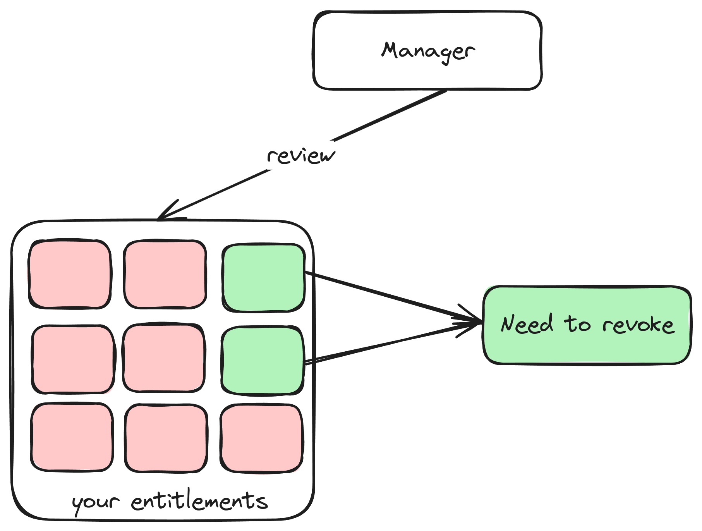

# What is certification?
## Context
In a company, you have been requested a lot of entitlements from many applications. With `IIQ,` you have a `Policy` to check conflicts in your entitlements, but you need a process for someone to review your entitlements if your current entitlements are suitable or not. This process will be called `Certification`

## Definition
In IdentityIQ, the term `certification` or `certification campaign` refers to an overall campaign to review access for a **selected set of users** – that is, to create and then complete a **set of access reviews**.

## Certification Scheduler
Certifications can be scheduled to run on a periodic basis; they can also be triggered by an event, or run as a one-off process.

- **Periodic Certifications**: This allows you to schedule certification campaigns to run monthly, quarterly, or annually.

- **Event-Based Certifications**: This enables you to specify an event, such as a change in manager, which will trigger a certification.

- **One-off Certification**: This involves running a single certification and then discontinuing it. It is reserved for special situations, such as when you need to conduct a certification for only one identity or access review required outside of the normal certification cycle (when neither of the above options is suitable).

## Type of Certification
You can check this site for all the type of Certification: [Certification Type](https://documentation.sailpoint.com/identityiq/help/certification/types_of_certification.html)

## Content of Certification?
### Policies
In access reviews, Policy Violations show any violations of policy for an identity. The access reviewer(s) must take action on these violations before the certification can be completed.

There is a Policy Violations page in IdentityIQ that is separate from the access review page.

### Roles
Roles are essentially collections of permissions. Through roles, system entitlements can be grouped together and presented as a logical unit, such as a job function, rather than as a detailed and often difficult-to-interpret list of access rights. 

Within IdentityIQ, users are granted permissions through the roles that are assigned to them, or through roles they inherit through a role hierarchy.

### Entitlements
Entitlements are either permissions or specific values for an account attribute, such as group membership. In the context of certifications, entitlements refer to all the entitlements an identity has access to that are not included as part of a role that is assigned to the identity.

## Challenges
When an access reviewer has determined that the user's access should be revoked, you may want to allow the affected user to challenge the decision; for example, to share information with the reviewer about why they may need to retain the access in question.

To allow users to challenge revocation decisions, enable a **challenge period** as part of a certification's configuration

## Revocations
Revocation is when an identity's entitlements are altered (provision) in the source application, to remove any entitlements that were marked by the access reviewer as needing to be revoked.

If automatic provisioning is enabled in your system for the relevant application, revocation of access can happen without any further action from the reviewer, as a consequence of an access review decision.
    :::tip[Note]
    This means the relevant application using Read-Write Connector and can do the provision process synchronized
    :::

If the relevant application does not have automated provisioning enabled, then remediation of that application's entitlements is managed by the creation of manual work items for the Application Revoker or Application Owner, requesting that they change the identity's access or permissions manually. IdentityIQ alerts the Application Revoker or Application Owner about the manual work item via an email message.

Revocation period is enabled, IdentityIQ monitors the status of remediation requests

// TODO: When a revocation can be invoke?
Configuration settings in the certification setup determine when the revocation is processed.

Immediate Revocation: If the Process Revokes Immediately option is selected, then revocation is considered to be processed as soon as a reviewer makes and saves a Revoke decision, and the decision can not be changed. Note that this does not affect Approve decisions; those can be changed even after saving, but if an Approve decision is change to Revoke and saved, it can no longer be changed.

Revocation during a revocation phase: The revocation phase is entered when a certification is signed off, or when the active and challenge phases have ended. Until the certification enters this phase, reviewers can make changes to their approve and revoke decisions (unless the Process Revokes Immediately option described above was selected for the certification). Once the certification is in this phase, reviewers can no longer change their decisions.

## Escalation and Reminders
When a person who has been assigned a manual work item for revoking access does not complete the work in a timely manner, IdentityIQ can send that person email reminders or can even escalate the work to the next level, such as to their manager

The remediation parameters that are set in the certification configuration tell IdentityIQ what reminders and escalations to perform, and when.
- Revocation reminder emails: send email
- Escalations: escalate work item for higher level

## Phase of Certification
### Staging
This is an optional phase you can use to test or validate a certification before sending it to reviewers. The staging phase lets you create a certification and associated access reviews, but not send the access reviews to the certifiers. You can view what the certification schedule definition produces before the certification is activated. If the generated certification does not match your needs, you can cancel the certification and redefine it as needed. If the certification is accurate, you can activate it. If you want to use a staging period, you enable it as part of the certification's configuration parameters at the time you set up the certification.

### Active
The active phase is the review period when the reviews are performed – that is, when all decisions that are required for the access review are made. During this phase, reviewers make decisions about access, and changes can be made to these decisions as frequently as required, until the access period expires. The active period lasts either for a scheduled amount of time or until all the access reviews for the certification have been signed off. You can sign off on the active stage if no roles or entitlements were revoked, or if the optional challenge period has not been enabled. When you sign off on a periodic certification it enters either an end phase, or, if enabled, a revocation phase. To enter the revocation phase, the revocation period must be enabled, and at least one revocation decision must exist.

### Challenge
The challenge phase is an optional period when users can challenge all revocation requests if any of their roles, entitlements, or account group access are being removed. When the challenge phase begins, a work item and email are sent to each user affected by a revocation decision. The notifications contain the details of the revocation request and any comments added by the reviewer. The affected user has the duration of the challenge period to accept the loss of access, or challenge that decision. If you want to allow a challenge period, you enable it as part of the certification's configuration parameters at the time you set up the certification.

You can sign off on a certification in the challenge phase if all challenges are complete and no open decisions remain for the access review. When you sign off on an access review, it enters either the end phase, or, if enabled, the revocation phase. To enter the revocation phase, the revocation period must be enabled, and at least one revocation decision must exist.

### Revocation
The revocation phase is the period when all revocation work is completed. When the revocation phase is entered, revocation can be done either automatically or manually. Automatic revocation can happen if your provisioning provider is configured for automatic revocation or if your implementation is configured to work with a help desk solution and a help ticket is generated. If you don't have an automatic revocation process enabled, revocation is done manually via work requests assigned to the relevant users in IdentityIQ. For periodic certifications, the revocation phase starts when a periodic certification is signed off, or when the active and challenge phases have ended.

Revocation activity is monitored to ensure that inappropriate access to roles and entitlements is revoked in a timely manner. Revocation completion status is updated at an interval specified during the deployment of IdentityIQ. By default this is performed daily. You can view detailed revocation information by clicking the information icon in the access review then clicking the Details button on the information dialog. Revocation requests that are not acted upon during the revocation phase can be escalated as needed.

### End
If a Revocation phase is not enabled for the certification, revocations can be done during the end period. The end period also indicated when the access review is complete.

## Automatic Closing of Certifications

## Rules In Certifications

##  

 
